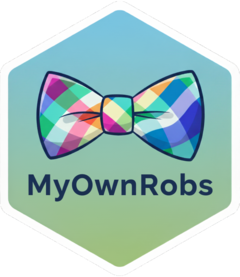

# MyOwnHadley <a href="https://myownhadley.github.io/myownhadley/"></a>

*By R users for R users*

**A Cursor-style AI Coding Agent for RStudio**

MyOwnHadley is a comprehensive AI-powered coding agent that seamlessly
integrates as an RStudio extension, bringing state-of-the-art AI
capabilities directly to R developers through an autonomous agent-based
approach.

## 🚀 Features

- **🤖 Autonomous AI Agent**: True coding agent that automatically
  selects and executes appropriate tools based on natural language
  requests
- **💬 Integrated Chat Interface**: Familiar Shiny-based chat experience
  directly in RStudio
- **🔧 Comprehensive Toolkit**: Complete set of development tools
  including file operations, code execution, and project management
- **🎯 Context Awareness**: Automatically detects project structure,
  active files, and working directory
- **⚡ Multi-step Workflows**: Handles complex tasks like “Build a Shiny
  app that visualizes my dataset” through intelligent tool orchestration
- **🔍 Code Analysis**: Read, analyze, and understand existing code to
  provide contextual assistance
- **✏️ Intelligent Editing**: Refactor, optimize, and enhance code based
  on natural language instructions

## 📦 Installation

Install the development version of `{myownhadley}` from
[GitHub](https://github.com/MyOwnHadley/myownhadley) with:

``` r
# install.packages("remotes")
remotes::install_github("MyOwnHadley/myownhadley")
```

## 🎯 Getting Started

1.  **Launch the Agent**: After installation, you can launch the agent
    by calling `myownhadley::myownhadley()` in the R console, or by
    opening the MyOwnHadley addin through the RStudio Addins menu:
    - Go to `Addins` \> `MyOwnHadley` in RStudio
    - Or use the command palette: `Ctrl/Cmd + Shift + P` → “MyOwnHadley”
2.  **Start Coding**: Simply describe what you want to accomplish in
    natural language:
    - “Create a function to clean this dataset”
    - “Build a ggplot visualization of the iris dataset”
    - “Refactor this code to be more efficient”
    - “Add error handling to my function”

## 🔒 Data Privacy

Your data privacy is important to us. Here’s a concise overview of
MyOwnHadley’s data practices:

- MyOwnHadley only stores per user their last active session, to
  maintain continuous functionality between chat sessions and
  RStudio/addin restarts.

- MyOwnHadley’s API is developed using Next.js, and all services are
  hosted on Google Cloud Platform.

- The API’s sole responsibility is to receive user’s prompt, enhance it
  with R-developer-specific context, and securely forward it to the
  user’s selected AI model provider. We do not store your prompts or the
  model responses on our servers beyond what is necessary for active
  session management.

**Our recommendation**: We recommend using MyOwnHadley with a project
only if you are comfortable with the possibility of submitting its
entire contents to your selected AI model provider, as the agent may
access various files for comprehensive assistance.

**Model Provider Data Policies**

- [Gemini’s data policy](https://ai.google.dev/gemini-api/terms).

We’ve strived to keep this section brief and clear. If you have any
further questions or concerns about data privacy, please don’t hesitate
to [submit an issue on our GitHub
tracker](https://github.com/MyOwnHadley/myownhadley/issues). We will
thankfully address your inquiries and update this section as needed.

## 🤝 Contributing

Contributions are welcome! Please feel free to submit a Pull Request.
For major changes, please open an issue first to discuss what you would
like to change.

Bug reports and new ideas or features are more than welcome at the
[issue tracker](https://github.com/MyOwnHadley/myownhadley/issues).

## 📄 License

This project is licensed under the MIT License - see the
[LICENSE](LICENSE) file for details.

------------------------------------------------------------------------

**MyOwnHadley** - Democratizing AI-assisted development for the R
community 🎉
